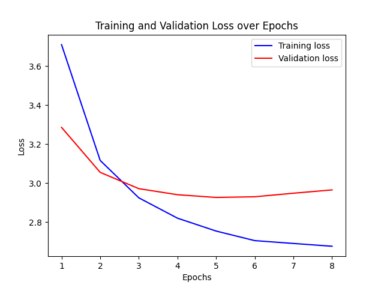

# Image Captioning with ResNet and LSTM

This project implements an image captioning model that generates textual descriptions for images. The model combines a **ResNet-50** convolutional neural network (CNN) as the encoder and an **LSTM** (Long Short-Term Memory) network as the decoder. The model is trained and evaluated on the **Flickr30k** dataset.

---

## Project Structure

- **`src/`**: Contains the source code for the project.
  - `models/`: Implementation of the encoder, decoder, and the combined image captioning model.
  - `training/`: Scripts for training, inference, and evaluation.
  - `utils/`: Utility functions for tokenization, vocabulary building, and data preprocessing.
  - `data/`: Dataset handling and preprocessing.
  - `config/`: Configuration file for hyperparameters and paths.
- **`outputs/`**: Stores the results
- **`requirements.txt`**: Lists the dependencies required to run the project.

---

## Model Description

### Encoder
The encoder is a **ResNet-50** model (pretrained on ImageNet) that extracts image features. The fully connected layer of ResNet-50 is replaced with a linear layer to project the features into an embedding space.

### Decoder
The decoder is an **LSTM** network that generates captions based on the image features. It uses:
- Word embeddings for input tokens.
- A linear layer to map the LSTM's hidden state to vocabulary scores.

### Combined Model
The encoder and decoder are combined into a single model, where the encoder processes the image and the decoder generates the caption.

---

## Dataset

The model is trained on the **Flickr30k** dataset, which contains 31,000 images, each paired with five captions.

---

## Installation

1. Clone the repository:
   ```bash
   git clone <repository-url>
   cd resnet_lstm_image_captioning
   ```

2. Install the required dependencies:
    ```bash
    pip install -r requirements.txt
    ```

---

## Running the Project

1. Training the model

    ```bash
    python -m src.training.train
    ```

    This script will:

    - Load the dataset and preprocess it.
    - Train the model for the specified number of epochs.
    - Save the best model to the `outputs/` directory.


2. Generating Captions


    ```bash
    python -m src.training.inference
    ```

    You can specify the image path in the script or use a sample image from the dataset.

3. Evaluating the Model

    ```bash
    python -m src.training.evaluate_metrics
    ```

    The results will be saved in `outputs/`
---
## Results

#### Training and Validation Loss:

The training and validation loss over epochs are plotted and saved in the `outputs/` directory. summary of the losses are shown in the following figure:



#### ROUGE Scores
The model's performance is evaluated using ROUGE scores, which measure the overlap between generated captions and ground truth captions. The results are as follows:

- ROUGE-1: 0.3401
- ROUGE-2: 0.1107
- ROUGE-L: 0.3028
- ROUGE-Lsum: 0.3029

For detailed results, see [outputs\rouge_results.txt](./outputs/rouge_results.txt)

--- 

## Configuration

The model's hyperparameters and paths are defined in [src/config/config.py](./src/config/config.py). Key parameters include:

- EMBED_SIZE: 256
- HIDDEN_SIZE: 256
- VOCAB_MIN_FREQ: 5
- BATCH_SIZE: 64
- NUM_EPOCHS: 50
- LEARNING_RATE: 0.001

## Dependencies
The project requires the following Python libraries:

```
torch==2.2.0
torchvision==0.17.0
datasets==2.12.0
evaluate==0.4.6
nltk==3.8.1
Pillow==12.0.0
matplotlib==3.7.2
```

For the full list, see [requirements.txt](/requirements.txt).